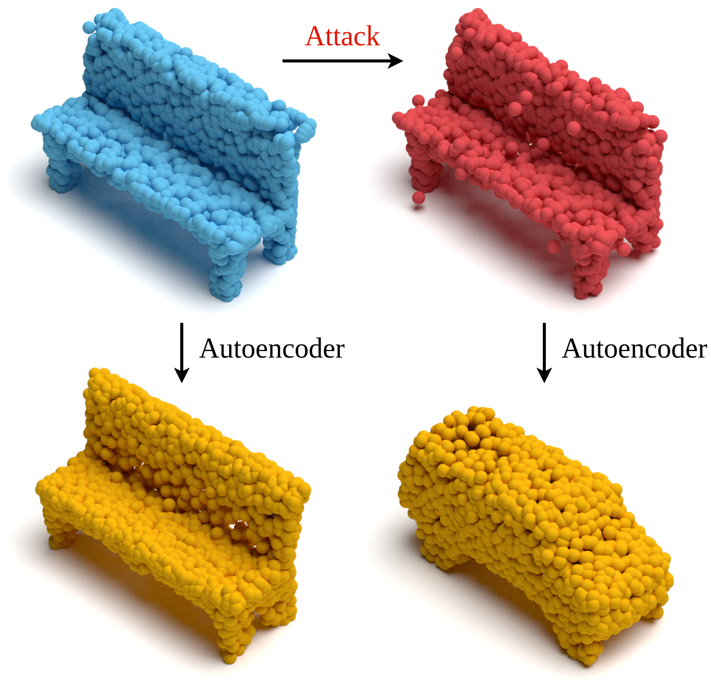

# Geometric Adversarial Attacks and Defenses on 3D Point Clouds
Created by Itai Lang, Uriel Kotlicki, and Shai Avidan from Tel Aviv University.

[[Paper]](https://arxiv.org/abs/2012.05657) [[Introduction Video (2 minutes)]](https://slideslive.com/38972228/geometric-adversarial-attacks-and-defenses-on-3d-point-clouds) [[Introduction Slides]](./doc/introduction_slides.pdf) [[Full Video (10 minutes)]](https://slideslive.com/38972369/geometric-adversarial-attacks-and-defenses-on-3d-point-clouds) [[Full Slides]](./doc/full_slides.pdf) [[Poster]](./doc/poster.pdf)



## Introduction
This code repository is based on our [arXiv tech report](https://arxiv.org/abs/2012.05657). Please read it for more information.

Deep neural networks are prone to adversarial examples that maliciously alter the network's outcome. Due to the increasing popularity of 3D sensors in safety-critical systems and the vast deployment of deep learning models for 3D point sets, there is a growing interest in adversarial attacks and defenses for such models. So far, the research has focused on the semantic level, namely, deep point cloud classifiers. However, point clouds are also widely used in a geometric-related form that includes encoding and reconstructing the geometry.

In this work, we are the first to consider the problem of adversarial examples at a geometric level. In this setting, the question is how to craft a small change to a clean source point cloud that leads, after passing through an autoencoder model, to the reconstruction of a different target shape. Our attack is in sharp contrast to existing semantic attacks on 3D point clouds. While such works aim to modify the predicted label by a classifier, we alter the entire reconstructed geometry. Additionally, we demonstrate the robustness of our attack in the case of defense, where we show that remnant characteristics of the target shape are still present at the output after applying the defense to the adversarial input.

## Citation
If you find our work useful in your research, please consider citing:

    @InProceedings{lang2021geometric_adv,
      author = {Lang, Itai and Kotlicki, Uriel and Avidan, Shai},
      title = {{Geometric Adversarial Attacks and Defenses on 3D Point Clouds}},
      booktitle = {Proceedings of the International Conference on 3D Vision (3DV)},
      pages = {1196--1205},
      year = {2021}
    }

## Installation
The code has been tested with Python 3.6.12, TensorFlow 1.13.2, TFLearn 0.3.2, PyTorch 1.6.0, CUDA 10.1, and cuDNN 7.6.5 on Ubuntu 16.04.

Clone this code repository:
```bash
git clone https://github.com/itailang/geometric_adv.git
```

Create a conda environment and install dependencies:
```bash
conda create -n geometric_adv python=3.6 --yes
conda activate geometric_adv
cd geometric_adv
cat requirements.txt | xargs -n 1 pip install
conda install pytorch==1.6.0 torchvision==0.7.0 cudatoolkit=10.1 -c pytorch --yes
```

### Compilation of Ops
Compile TensorFlow ops: nearest neighbor grouping, implemented by [Qi et al.](https://github.com/charlesq34/pointnet2), and structural losses, implemented by [Fan et al.](https://github.com/fanhqme/PointSetGeneration) The ops are located under `external` folder, in `grouping` and `structural losses` folders, respectively. The compilation scripts uses CUDA 10.1 path. If needed, modify the corresponding `sh` file of each op to point to your CUDA path. Then, use:
```bash
cd geometric_adv
sh compile_ops_tf.sh
```

An `o` and `so` files should be created in the corresponding folder of each op. 

Compile PyTorch op: Chamfer Distance, implemented by [Groueix et al.](https://github.com/ThibaultGROUEIX/AtlasNet) The op is located under `transfer/atlasnet/auxiliary/ChamferDistancePytorch/chamfer3D` folder. The following `sh` compilation script uses CUDA 10.1 path. If needed, modify script to point to your CUDA path. Then, use:
 ```bash
cd geometric_adv
sh compile_op_pt.sh
```

The compilation results should be created under `transfer/atlasnet/build` folder.

## Usage

### Overview
Our code is organized in the following folders:
* [autoencoder](https://github.com/itailang/geometric_adv/blob/master/autoencoder): scripts for training a victim autoencoder and an autoencoder for attack transfer.
* [attacker](https://github.com/itailang/geometric_adv/blob/master/attacker): scripts for running the attacks.
* [defender](https://github.com/itailang/geometric_adv/blob/master/defender): scripts for running the defenses.
* [classifier](https://github.com/itailang/geometric_adv/blob/master/classifier): source code for training a classifier for semantic interpretation, and scripts for semantic evaluation of the attacks and defenses.
* [transfer](https://github.com/itailang/geometric_adv/blob/master/transfer): source code for training an AtlasNet autoencoder and a FoldingNet autoencoder for attack transfer (under `atlasnet` and `foldingnet` folders, respectively), and scripts for running attack transfer.
* [src](https://github.com/itailang/geometric_adv/blob/master/src): implementation of the autoencoder for attack, the adversary, and utility helper functions.
* [external](https://github.com/itailang/geometric_adv/blob/master/external): external public source code, implementing TensorFlow ops and Python i/o for ply files.

The following sub-sections explain the following items:
* [Download Models and Data](#download-models-and-data): how to download the trained models and data used for the experiments in our work.
* [Attacks](#attacks), [Defenses](#defenses), [Semantic Interpretation](#semantic-interpretation), and [Transfer](#transfer): how to run the experiments described in the paper. 

### Download Models and Data
Download the trained models and data for our experiments:
```bash
cd geometric_adv
bash download_models_and_data.sh
```

The models (about 200MB) will be saved under `log` folder, in the following folders:
* `autoencoder_victim`: a victim autoencoder for the attack and defense experiments.
* `pointnet`: a classifier for the semantic interpretation experiment.
* `autoencoder_for_transfer`, `atlasnet_for_transfer`, and `foldingnet_for_transfer`: autoencoders for the attack transfer experiment. 

The data (about 220MB) will be saved under `log/autoencoder_victim/eval` folder.

### Attacks
First, save the default configuration of the victim autoencoder using:
```bash
cd autoencoder
python train_ae.py --train_folder log/autoencoder_victim --save_config_and_exit 1
```

The configuration will be saved to the folder `log/autoencoder_victim`.

Then, prepare indices for the attack using:
```bash
cd ../attacker
bash runner_indices_for_attack.sh
```

The script will prepare random indices for source point clouds to attack. It will also prepare a nearest neighbors matrix that will be used for selecting target point cloud candidates for the attack. The data will be saved to `log/autoencoder_victim/eval` folder.

Next, run and evaluate the output and latent space attacks using:
```bash
cd ../attacker
sh runner_attacker.sh
```

Attack results will be saved to the folders `log/autoencoder_victim/eval/output_space_attack` and `log/autoencoder_victim/eval/latent_space_attack`. Under the attack folder there is a folder for each source class.

The script `runner_attacker.sh` uses the following scripts:
* `run_attack.py` is used to optimize the attack. For each source class folder, it saves adversarial metrics (`adversarial_metrics.npy`), adversarial examples (`adversarial_pc_input.npy`), and their reconstruction by the victim autoencoder (`adversarial_pc_recon.npy`).
* `get_dists_per_point.py` computes additional data required for the attack evaluation (`adversarial_pc_input_dists.npy`).
* `evaluate_attack.py` analyzes the attack results. Statistics for the attack will be saved to the file `over_classes/eval_stats.txt`.

When running `evaluate_attack.py`, you can use the following additional flags:
* `--save_graphs 1`: to save graphs of adversarial metrics for each source class.
* `--save_pc_plots 1`: to save visualization of the source point clouds, adversarial examples, target point clouds, and their reconstruction.

### Defenses
Run critical points and off-surface defenses against the output and latent space attacks using:
```bash
cd ../defender
sh runner_defender.sh
```

Under each attack folder, defense results will be saved to the folders `defense_critical_res` and `defense_surface_res`. Under these defense folders, there is a folder for each source class. 

The script `runner_defender.sh` uses the following scripts:
* `run_defense_critical.py` and `run_defense_surface.py` save defense metrics (`defense_metrics.npy`), defended point clouds (`defended_pc_input.npy`), and their reconstruction by the victim autoencoder (`defended_pc_recon.npy`). These files will be saved to each source class folder. 
* `evaluate_defense.py` analyzes the defense results. Statistics for the defense will be saved to the file `over_classes/eval_stats.txt`.

When running `evaluate_defense.py`, you can use the following additional flags:
* `--save_graphs 1`: to save graphs of defense metrics for each source class.
* `--save_pc_plots 1`: to save visualization of the source point clouds, adversarial examples, defended point clouds, and their reconstructions. In the adversarial examples, points that are filtered by the defense will be marked in Red.
* `--use_adversarial_data 0`: to evaluate the defense results on source point clouds.

### Semantic Interpretation
Use the trained classifier to evaluate the semantic interpretation of reconstructed adversarial and defended point clouds:
```bash
cd ../classifier
sh runner_classifier.sh
```

The script `runner_classifier.sh` uses the following scripts:
* `run_classifier.py` gets the classifier's predictions for reconstructed adversarial and defended point clouds. The classifier's results will be saved under the corresponding attack and defense folders to a folder named `classifer_res`. Under this folder, there is a folder for each source class with the classifier's predictions.
* `evaluate_classifier.py` evaluates the semantic interpretation of the reconstructed point clouds. Statistics for the classifier will be saved to the folder `classifer_res/over_classes`. 

Note:
* The semantic interpretation of reconstructed source and target point clouds is also evaluated (for reference). The name for the classifier's folder, in this case, is `classifer_res_orig`.
* When running `evaluate_classifier.py`, you can use an additional flag `--save_graphs 1`, to save graphs of the classifier's predictions for each source class.

### Transfer
Run and evaluate the adversarial examples through the autoencoders for attack transfer using:
```bash
cd ../transfer
sh runner_transfer.sh
```

This script will run the adversarial examples of the output and latent space attacks through the three autoencoders for transfer described above. If you trained part of these autoencoders, edit the script accordingly. 

The script `runner_transfer.sh` uses the following scripts:
* `run_transfer.py` uses an autoencoder for transfer to reconstruct adversarial point clouds (`transferred_pc_recon.npy`) and compute transfer metrics (`transfer_metrics.npy`) for each source class. The results are saved to an attack transfer folder, under the autoencoder for transfer. For instance: `log/autoencoder_for_transfer/output_space_attack_transfer`.
* `evaluate_transfer.py` compute transfer statistics that are saved to the file `over_classes/eval_stats.txt` under the attack transfer folder.

When running `evaluate_transfer.py`, you can use the following additional flags:
* `--save_graphs 1`: to save graphs of transfer metrics for each source class.
* `--save_pc_plots 1`: to save visualization of the source point clouds, adversarial examples, and their reconstructions by the victim autoencoder or autoencoder for transfer.

## Retrain Models
In the [previous section](#usage) you employed the models that we used in our work. In this section we explain the steps for retraining these models. It may be useful as a reference example, in case you want to use different data than that we used.

### Data Set
Download point clouds of [ShapeNetCore](https://www.shapenet.org) shape models, provided by [Achlioptas et al.](https://github.com/optas/latent_3d_points) (about 1.4GB, in ply format):
```bash
cd geometric_adv
sh download_data_set.sh
```

Each point cloud contains 2048 points, uniformly sampled from the shape surface. The data will be downloaded to a folder named `geometric_adv/data/shape_net_core_uniform_samples_2048`.

### Victim Autoencoder
Train a victim autoencoder model using:
```bash
cd autoencoder
sh runner_ae_for_attack.sh
```
The model will be saved to the folder `log/autoencoder_victim`.

The script `runner_ae_for_attack.sh` uses the following scripts:
* `train_ae.py` is used to train the autoencoder.
* `tst_ae.py` prepares data for attack. The data will be saved to the folder `log/autoencoder_victim/eval`.

### Classifier
First, prepare data for training a classifier for semantic interpretation using:
```bash
cd ../autoencoder
sh runner_ae_for_classifier.sh
```

This script saves the point clouds of the train and validation sets that were used during the victim autoencoder's training. These points clouds and their labels will be used for training the classifier. The data will be saved to the folders `log/autoencoder_victim/eval_train` and `log/autoencoder_victim/eval_val`. Note that these point clouds of the train the validation sets will be used for the training of autoencoders for transfer (see seb-section [Autoencoders for Attack Transfer](#autoencoders-for-attack-transfer) below).

Then, train the classifier using:
```bash
cd ../classifier
python train_classifier.py
```

### Autoencoders for Attack Transfer
Train autoencoders other than the victim one to perform attack transfer. These autoencoders will be trained on the same data set as the attacked autoencoder. Note that the autoencoders for transfer are independent of each other, and you can choose which one to train and run transfer with. 

To train an autoencoder with the same architecture of the victim and different weight initialization, use:
```bash
cd ../autoencoder
sh runner_ae_for_transfer.sh
```

The model will be saved to the folder `log/autoencoder_for_transfer`.

To train an AtlasNet autoencoder, use:
```bash
cd ../transfer/atlasnet
sh runner_atlasnet.sh
```

The model will be saved to the folder `log/atlasnet_for_transfer`.

To train a FoldingNet autoencoder, use:
```bash
cd ../../transfer/foldingnet
sh runner_foldingnet.sh
```

The model will be saved to the folder `log/foldingnet_for_transfer`.

## License
This project is licensed under the terms of the MIT license (see the `LICENSE` file for more details).

## Acknowledgment
Our code builds upon the code provided by [Achlioptas et al.](https://github.com/optas/latent_3d_points), [Qi et al.](https://github.com/charlesq34/pointnet), [Groueix et al.](https://github.com/ThibaultGROUEIX/AtlasNet), and [Yan Wei](https://github.com/YanWei123/Pytorch-implementation-of-FoldingNet-encoder-and-decoder-with-graph-pooling-covariance-add-quanti). We thank the authors for sharing their code.
